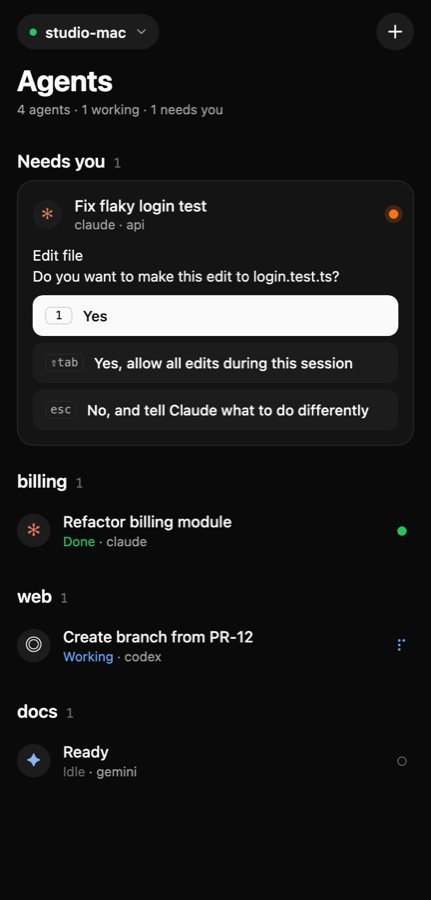
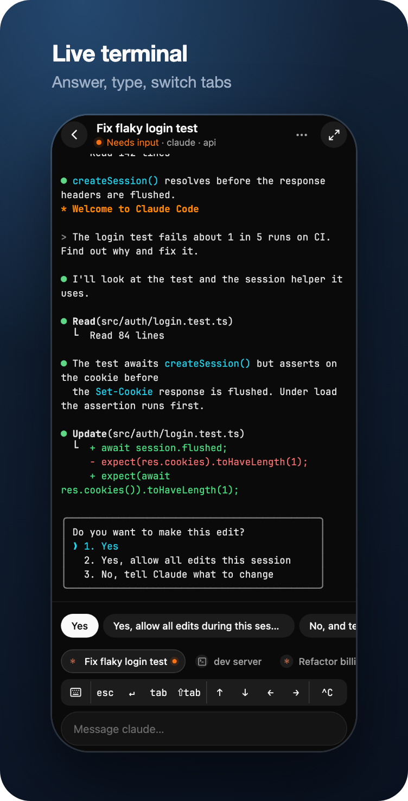
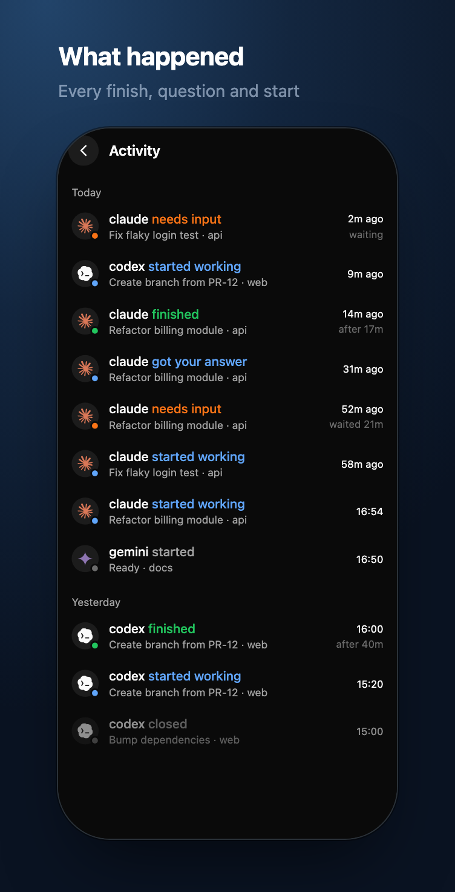
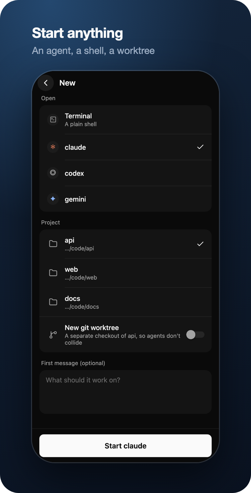
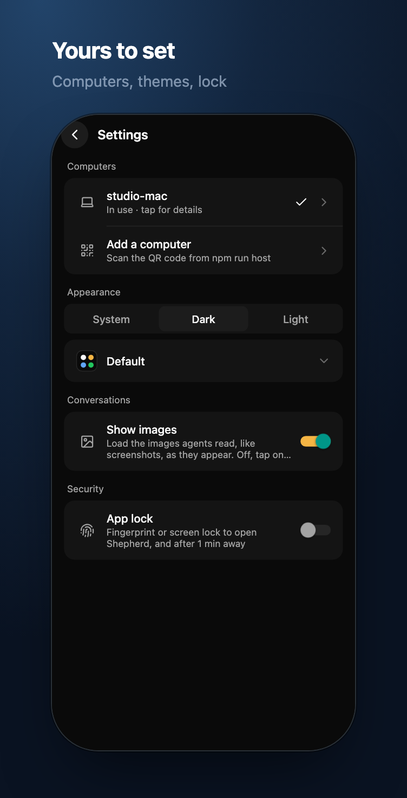
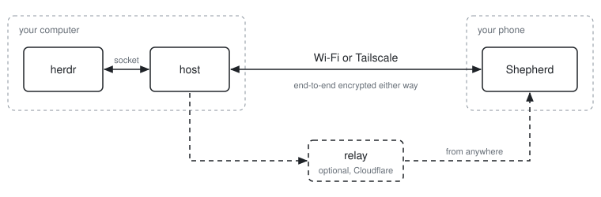

<p align="center"></p>

<h1 align="center">Shepherd</h1>

<p align="center"><a href="https://github.com/zenodea/shepherd/actions/workflows/ci.yml"></a></p>

<p align="center">Check on and steer your <a href="https://herdr.dev">herdr</a> agents from your phone: see which agents need input, read their output, answer prompts, and send new instructions.</p>

<p align="center">
  
  
  
  
  
</p>

- **host**: a small Node service on your computer, installed as a herdr plugin. It talks to herdr's local socket and only lets in phones you've paired.
- **app**: the mobile app (Expo / React Native).
- **relay** (optional): a Cloudflare Worker you deploy yourself, so your phone can reach your computer from anywhere.

## Quick start

### 1. Prerequisites

- [herdr](https://herdr.dev) 0.9 or newer, running (just run `herdr`)
- [Node.js](https://nodejs.org) 22.18 or newer
- A phone

### 2. Install the herdr plugin

```bash
herdr plugin install zenodea/shepherd
herdr plugin action invoke shepherd.restart   # start it now; afterwards it starts with herdr
```

herdr shows what the plugin runs before installing it, then installs the host's dependencies. From then on the host starts in the background whenever herdr does, and stops about a minute after herdr exits.

### 3. Show the pairing QR code

```bash
herdr plugin action invoke shepherd.pair
```

This opens the **Shepherd window** in herdr on its Pair screen, with a **pairing QR code**. Once your phone has paired, the window switches to your phones and shows it connected.

```
  Shepherd  ● running · my-laptop

   o Overview    Pair    d Phones   l Log
  ─────────────────────────────────────────────────────

  Scan with the Shepherd app (Host → Scan QR code). One-time code, valid for 9:41.
   ▄▄▄▄▄▄▄ ▄▄▄▄▄ ▄   ▄▄▄▄ …
  Or enter it by hand: p_…
```

The QR code holds the host's name, every address it can be reached on, and a **one-time pairing code**. The code works once and expires after 10 minutes. When your phone scans it, the host gives that phone its own token, so a photo of the QR code is useless afterwards. Press `p` in the window for a new code.

### The Shepherd window

The window has four screens; switch with the letter keys or Tab:

- **Overview (`o`):** whether Shepherd is on and for how long, the herdr session, your agents, how many phones are connected, the addresses it's reachable on, the relay and notifications. Two switches live here: `s` turns Shepherd on or off, and `t` turns notifications on or off.
- **Pair (`p`):** the QR code, with a countdown.
- **Phones (`d`):** every paired phone, connected ones first with how they're connected (direct or through the relay). Select one and press `x` to revoke it.
- **Log (`l`):** the host's recent log.

`r` restarts the host from any screen, `n` sends a test notification from the Overview, and `q` or Esc closes the window.

Turning Shepherd **off** stops the host and keeps it stopped: herdr won't start it again until you turn it back on, so no phone can connect. Turning notifications off and on again keeps the same ntfy topic, so your phone stays subscribed.

To open it with a key, add this to herdr's `config.toml` (then `herdr server reload-config`):

```toml
[[keys.command]]
key = "prefix+alt+s"
type = "plugin_action"
command = "shepherd.open"
description = "shepherd"

[[keys.command]]
key = "prefix+alt+p"
type = "plugin_action"
command = "shepherd.pair"
description = "pair a phone"
```

`shepherd.restart` restarts the host without opening the window. Outside herdr, `npm run host -- ui` opens the same window in any terminal.

**Without the plugin:** run the host from a clone of this repo with `npm run host` (after `npm install`). It prints a pairing QR code in your terminal.

### 4. Get the app on your phone

The app is built from this repo:

```bash
git clone https://github.com/zenodea/shepherd.git
cd shepherd
npm install
```

Then pick one of the three options below.

**Option A: Build an APK in the cloud (easiest, free Expo account)**

```bash
npx eas-cli@latest login
npm run build:apk -w @shepherd/mobile
```

The first run asks to create the EAS project. When the build finishes, open the link it prints on your phone and install the APK. You may need to allow installing apps from your browser.

**Option B: Build the APK locally** (needs JDK 17 and the Android SDK, e.g. via Android Studio)

```bash
npm run build:apk:local -w @shepherd/mobile
adb install apps/mobile/android/app/build/outputs/apk/release/app-release.apk
```

This APK is signed with the debug key, which is fine for personal use but not for the Play Store.

**Just want to look around first?** Run `npm run app:demo` and open it in Expo Go. It's a demo mode with a pretend computer and pretend agents, so you don't need a host.

**Option C: Try it without building (development)**

Install **Expo Go** from the Play Store, run `npm run app:prod` (or `npm run app` while developing), and scan the QR code **from inside the Expo Go app**. The app doesn't run in a web browser.

If Expo Go can't load the project, your phone probably can't reach your computer at the `exp://…:8081` address Metro prints. This happens on guest, office and university Wi-Fi. If both devices are on Tailscale, use your computer's Tailscale IP instead:

```bash
REACT_NATIVE_PACKAGER_HOSTNAME=100.x.y.z npm run app
```

### 5. Connect

Open the app, tap **Scan QR code**, and point the camera at the QR code from step 3. If you installed the APK, scanning with your phone's own camera app works too.

The app tries every address in the QR code at once and uses whichever answers first. It works at home, on Tailscale or through the relay without you choosing, and it switches over when you change networks. If you can't scan, choose **Enter address and pairing code manually** and use the `Code:` line.

## What you can do

- **See every agent at a glance.** Agents that need input come first, with their question and one button per answer.
- **Read the conversation.** Agents open on their conversation: your messages, their replies and each tool call (tap one to see its output), read from the transcript Claude Code, Codex or pi writes. It scrolls like a chat app however the agent draws its screen, and older messages load as you scroll up.
- **Watch the live terminal.** Tap the terminal icon to switch. The agent is fitted to your screen as native text. Scroll up for the history, pinch to resize, search, long-press to copy, tap links.
- **Steer it.** Send a message, tap an answer, use the quick keys (esc, ↵, tab, arrows, ^C), or tap ⌨ to type straight into the terminal.
- **Switch tabs and start things.** Hop between herdr tabs like tmux windows, open a shell, or start claude, codex, gemini… in a project or a fresh git worktree.
- **Manage agents.** Long-press an agent (or tap ⋯) to rename it, rename its workspace, or close it.
- **See what happened.** The activity feed shows what your agents did while you were away, and how long they waited for you.
- **Several computers.** Pair with as many as you like and switch from the top of the agent list.
- **App lock.** Require your fingerprint to open Shepherd (Settings).
- **Get notified** when an agent needs input or finishes, and answer from the notification.

## Notifications

Notifications go through [ntfy](https://ntfy.sh), a free, open-source push service. No Firebase or Google account needed.

```bash
npm run host -- notify on       # or: notify on https://your-ntfy-server
herdr plugin action invoke shepherd.restart   # apply (or restart `npm run host`)
```

Install **ntfy** on your phone, scan the QR code `notify on` prints (or tap **Host → Get notifications** in Shepherd), then run `npm run host -- notify test`.

When an agent asks a question, the notification shows it with up to three answers as buttons. A button can only pick one of the offered answers, works once, expires after 30 minutes, and is ignored if the agent has moved on. Anyone who can read your topic could press them, so treat the topic like a password, or run `npm run host -- notify actions off`.

## Keep the host running in the background

With the plugin, the host already runs in the background while herdr does. If it ever stops, `herdr plugin action invoke shepherd.restart` starts it again.

If you'd rather have the host supervised by your system (started at login and restarted if it stops, herdr or not), or you don't use the plugin, install it as a service. The plugin leaves the host to the service while one is installed.

```bash
npm run host -- service install   # starts now, at every login, and restarts if it stops
npm run host -- service status
npm run host -- service logs      # follow the log
npm run host -- service uninstall
```

On macOS this installs a launchd agent (`~/Library/LaunchAgents/dev.shepherd.host.plist`, logs in `~/Library/Logs/shepherd-host.log`). On Linux it's a systemd user unit (`shepherd-host.service`); run `loginctl enable-linger $USER` to keep it running while you're logged out.

- **Environment:** the service remembers the `PATH` you install it from, so it can find `herdr` and your agent CLIs. It also remembers any `SHEPHERD_*` or `HERDR_SESSION` settings. Re-run `service install` after changing them.
- **Starting before herdr:** if the service starts before herdr (for example at login), it waits for herdr to come up.
- **Pairing more phones:** run `npm run host -- pair` in any terminal. The running service picks up the new code immediately.
- **Code changes:** after pulling new Shepherd code, restart the service with `service install`.

## Using it away from home

<picture>
  <source media="(prefers-color-scheme: dark)" srcset="docs/architecture-dark.svg" />
  
</picture>

Your phone has to reach the host. There are two ways.

### Tailscale (simplest)

Install [Tailscale](https://tailscale.com) on your computer and phone. The host detects its Tailscale address and puts it in the QR code automatically, so there's nothing to configure. Just make sure Tailscale is switched on on your phone.

### Your own relay (no VPN on the phone)

Deploy the relay to your Cloudflare account. The free Workers plan is enough for personal use.

```bash
cd apps/relay
npx wrangler login
openssl rand -base64 32              # copy this: it's your relay host token
npx wrangler secret put HOST_TOKEN   # paste it
npm run deploy                       # prints https://shepherd-relay.<you>.workers.dev
cd ../..

npm run host -- relay https://shepherd-relay.<you>.workers.dev <relay host token>
herdr plugin action invoke shepherd.restart   # apply (or restart `npm run host`)
```

Phones that are already paired learn the relay address the next time they connect, on Wi-Fi or Tailscale. After that they use it automatically whenever your computer isn't reachable directly. New QR codes include it too.

How it works:
- The host keeps one outbound connection open to the relay.
- When the app connects, the relay asks the host to dial back, then pipes the two connections together.
- Everything between the phone and your computer is end-to-end encrypted, so the relay only ever forwards ciphertext. See [Security model](#security-model).
- To decide who may connect at all, the relay checks a hash of each phone's token against the list the host registered. That hash is useless for logging in to the host.

## Host commands

Run these from your clone of the repo. They share `~/.config/shepherd` with the plugin's host, so after changing a setting, apply it with `herdr plugin action invoke shepherd.restart`.

```bash
npm run host                      # run
npm run host -- pair              # new one-time pairing QR code
npm run host -- info              # addresses and paired devices
npm run host -- devices           # list paired phones
npm run host -- devices revoke <id|all>  # unpair (disconnects immediately)
npm run host -- relay <url> <tok> # connect through a relay
npm run host -- relay off         # stop using the relay
npm run host -- notify on [url]   # push notifications via ntfy
npm run host -- notify test       # send a test notification
npm run host -- notify off        # stop notifications
npm run host -- notify actions on|off  # answer buttons on notifications (default on)
npm run host -- status            # is the host running, addresses, devices, recent log
npm run host -- restart | stop    # restart or stop a host running in the background
npm run host -- on | off          # turn Shepherd on or off (off: herdr doesn't start it)
npm run host -- ui                # the Shepherd window (status, pairing, phones, log)
```

| Variable | Default | |
|---|---|---|
| `SHEPHERD_PORT` | `7420` | Port for direct connections |
| `SHEPHERD_BIND` | `0.0.0.0` | Use `127.0.0.1` if you only want relay access |
| `SHEPHERD_CONFIG` | `~/.config/shepherd/host.json` | Config file |
| `HERDR_SESSION` / `HERDR_SOCKET_PATH` | default session | Target another herdr session |
| `HERDR_BIN` | `herdr` | herdr binary |

## Security model

- **Pairing:** each phone gets its own random token (the host stores only a hash). Pairing codes work once and expire after 10 minutes. `devices revoke` cuts a phone off immediately.
- **End-to-end encryption** on every connection, including through the relay: a Noise NK-style handshake with the host's X25519 key pinned from the QR code, then ChaCha20-Poly1305. The relay only ever sees ciphertext. Built on the audited [@noble](https://paulmillr.com/noble/) libraries (`packages/protocol/src/secure.ts`).
- **Limited API:** the host forwards only an allowlist of herdr methods (`FORWARDED_METHODS` in `packages/protocol/src/wire.ts`), and starts agents only as installed agent types in existing workspaces. A leaked token can't run shell commands through the API, but it can type into your terminals, so revoke lost phones.
- **Conversations:** the app asks for an agent's conversation by its pane, never by a file path. The host reads only the transcript that belongs to that agent (in `~/.claude/projects`, `~/.codex/sessions` or `~/.pi/agent/sessions`), which shows what the pane already shows.

## Development

```bash
npm run typecheck   # all workspaces
npm test            # protocol, host, app client and relay end-to-end tests
npm run lint        # app lint
npm run dev -w @shepherd/host   # host with auto-reload
npm run relay                  # relay locally (copy apps/relay/.dev.vars.example to apps/relay/.dev.vars)
npm run app:demo               # the app with a fake host (EXPO_PUBLIC_DEMO=1)
npm run demo:web -w @shepherd/mobile   # the demo in a browser, handy for design work
```

```
herdr-plugin.toml     the herdr plugin: installs the host, starts it with herdr, opens the Shepherd window
apps/
  host/src/
    cli.ts            entry point and commands
    herdr/            herdr socket client, agent tracker, activity log, terminal streams, agent launcher
    connection/       WebSocket server, encrypted session, relay tunnel
    pairing/          paired devices, pairing codes, QR output
    notifications/    ntfy notifier and answer buttons
    conversation/     agents' conversations from Claude Code, Codex and pi transcripts
    system/           config file, launchd/systemd service, background host for the plugin, live status
    ui/               the Shepherd window (a terminal UI)
    testing/          fake herdr and test clients
  mobile/src/
    app/              screens (Expo Router)
    connection/       host client (address racing, encryption), saved settings, pairing
    agents/           agent list helpers, answer cards, agent actions, activity feed, conversation view
    security/         app lock
    terminal/         native terminal view, links and search, raw keyboard input
    ui/               design system: tokens, buttons, rows, status indicators, agent marks
  mobile/assets/icon-src/  icon source (SVG); scripts/render-icons.sh renders the PNGs
  relay/src/          Cloudflare Worker + one HostRoom Durable Object per host
packages/
  protocol/src/       shared types: herdr API subset, app↔host messages, relay tunnel,
                      pairing links, end-to-end encryption, blocked-prompt parsing
```

How the host talks to herdr:
- **Agents and events:** herdr's socket API (`herdr api schema --json`). herdr answers one request per connection.
- **Live terminals:** `herdr terminal session control`, which streams screen frames as newline-delimited JSON. The host runs a headless xterm (`apps/host/src/herdr/screen-renderer.ts`) over those frames and sends only the rows that changed, as styled lines, which the app draws natively.
- **Conversations:** not from herdr's screen at all. The host finds the transcript file the agent's harness writes (from the path herdr's integration reports, or the newest session for the pane's folder), follows it as it grows, and turns each harness's records into one list of messages and tool calls (`apps/host/src/conversation/`). Full-screen agents have no scrollback, so this is what makes their history scrollable.

## License

[MIT](LICENSE)
